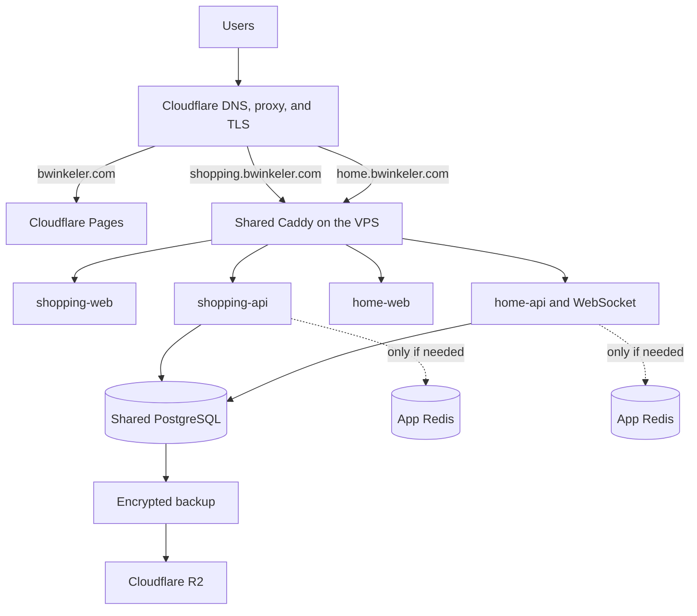
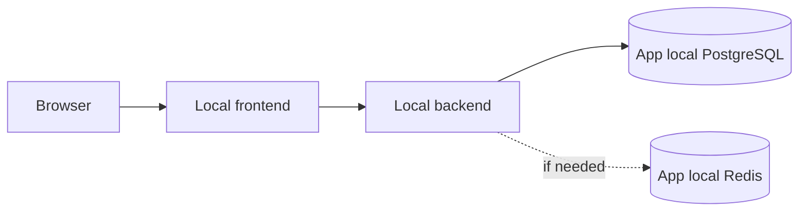
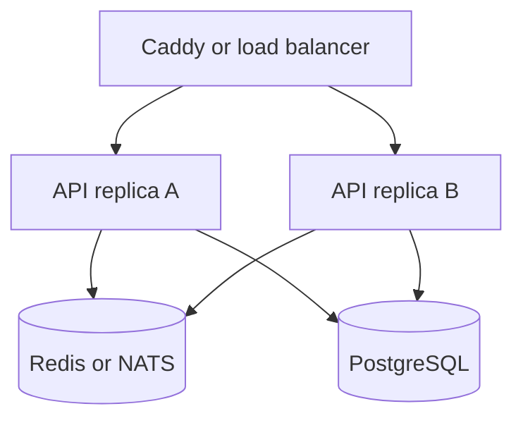
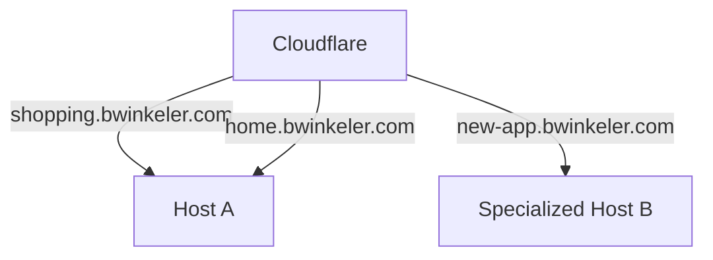

# `bwinkeler.com` Platform

## Architecture, contracts, and operations guide

| Field       | Value                         |
| ----------- | ----------------------------- |
| Document    | `BW-PLATFORM-ARCH-001`        |
| Version     | 1.3                           |
| Status      | Initial architecture approved |
| Last review | 2026-07-26                    |
| Owner       | Bruno Winkeler                |

This document defines the common architecture of the projects published under
`bwinkeler.com`. It must allow a person or an AI to work in a single repository
without needing prior knowledge of all the other repositories.

This is an architecture and contract document. The YAML, command, and
configuration examples show the expected shape of the solution, but must be
adapted and validated before being used in production.

---

## 1. How to use this document

### 1.1 Canonical source

Keep a canonical version of this file in the infrastructure repository. A copy
of the same version must exist in every application repository at:

```text
docs/PLATFORM_ARCHITECTURE.md
```

Each application must also have a specific file:

```text
docs/SERVICE_MANIFEST.md
```

The first explains the entire platform. The second records only the decisions of
that application, such as domain, ports, database, Docker aliases, migrations,
variables, resources, and rollback procedure.

When updating this document:

1. increment its version;
2. update the copy in the active repositories;
3. record the adopted version in each app's `SERVICE_MANIFEST.md`;
4. do not silently change a contract already used in production.

For a small number of repositories, copying the file explicitly is simpler and
more reliable than using Git submodules. A hash check in CI can be added in the
future to detect stale copies.

### 1.2 Instructions for AI assistants

When an AI works on any project of this platform, provide it with:

1. this document;
2. the application's `docs/SERVICE_MANIFEST.md`;
3. the current request;
4. errors or constraints observed in the environment.

The AI must respect these limits:

- do not add public Caddy or production PostgreSQL to the application Compose;
- it may and should keep a local PostgreSQL in the development Compose;
- do not publish backend, database, or Redis ports on the host in production;
- do not create or change global names without checking the service manifest;
- do not put secrets, passwords, or tokens in Git or in Docker images;
- do not change the schema directly outside the application's migration system;
- do not use `latest` in production images;
- do not introduce Redis, queues, Kubernetes, or other components without a
  concrete need;
- treat changes to Caddy, shared PostgreSQL, global networks, and backup as
  infrastructure repository changes;
- propose separately any change that affects another repository;
- preserve compatibility during migrations and deploys;
- update the `SERVICE_MANIFEST.md` when an operational contract changes.

### 1.3 Durable context and AI sessions

Chat history is not the canonical source of the platform. Each new session has
its own context and does not automatically inherit previous conversations, even
when it uses the same workspace. Decisions that need to survive a session must be
recorded in this document, in the service manifest, in an ADR, or in a runbook.

A handoff summary may record operational state and next steps, but does not
replace normative documents. It must never contain passwords, passphrases,
private keys, tokens, or other secrets.

To keep the context small and precise:

- use one session per product or responsibility;
- explicitly state which repository may be changed;
- consult other repositories only when there is cross-cutting impact;
- start a new session when the goal changes substantially;
- compact or archive long sessions after the decisions are documented.

### 1.4 Precedence rule

If there is a conflict, the order of precedence is:

1. security and data recovery requirements;
2. this architecture document;
3. the application's `SERVICE_MANIFEST.md`;
4. the repository's technical documentation;
5. implicit code conventions.

An intentional exception must be documented in the service manifest with its
reason, risks, and removal or revision plan.

---

## 2. Context and objectives

The platform starts with these products:

- `bwinkeler.com`: static portfolio with links to projects;
- `shopping.bwinkeler.com`: shopping list with persistence and login;
- `home.bwinkeler.com`: gamified household tasks, with persistence, login, and
  WebSockets;
- future applications of similar or larger size.

The initial audience is small, generally Bruno, his wife, and family members,
with fewer than 20 to 50 users. Primary access comes from the Netherlands. Low
latency in Brazil is not a requirement.

### 2.1 Objectives

- low and predictable monthly cost;
- independent application deploys;
- self-contained local development per repository;
- use of Docker and Docker Compose;
- reliable persistence;
- HTTPS and per-application subdomains;
- WebSocket support;
- external backups and testable restoration;
- ability to migrate each application separately;
- gradual evolution without adopting complex orchestration too early;
- sufficient context for AI-assisted work in a single repository.

### 2.2 Initial non-objectives

The following are not part of the first stage:

- multi-region high availability;
- Kubernetes;
- multiple replicas of each backend;
- distributed database;
- Redis shared across the platform;
- single sign-on across all applications;
- deploy without any second of downtime;
- commercial SLA;
- scalability to thousands of users.

These items can be added when metrics and requirements justify them.

---

## 3. Fundamental decisions

### 3.1 Addresses

Independent applications use subdomains:

```text
bwinkeler.com
shopping.bwinkeler.com
home.bwinkeler.com
<service>.bwinkeler.com
```

Do not use `bwinkeler.com/app` for independent applications. Subdomains allow each
application to be moved to another host or provider without changing the others.

Prefer first-level subdomains. For example, use `api-shopping.bwinkeler.com` only
if an API really needs to be public and separate. Avoid
`api.shopping.bwinkeler.com`, because common wildcard certificates do not
automatically cover that second level.

`bwinkeler.com` is the platform's canonical domain and was registered with
Cloudflare Registrar on 2026-07-26. The root domain is reserved for the portfolio
on Cloudflare Pages. Independent applications use subdomains directed to their own
origin host, initially the OVHcloud VPS.

### 3.2 Initial providers

- Cloudflare Registrar: registration and renewal of `bwinkeler.com`;
- Cloudflare: DNS, proxy, edge TLS, basic protection, and Pages;
- Cloudflare Pages: static portfolio;
- OVHcloud in Germany: initial VPS;
- Cloudflare R2: application files when needed and external backups;
- GitHub Container Registry or equivalent: versioned Docker images.

The VPS provider is not part of the applications' contract. An application must be
able to migrate to another VPS or PaaS by changing configuration and DNS, not
domain code.

The initial host uses the OVHcloud `VPS-1 2027` plan, with no fixed term, in the
`Europe (Germany - Limburg)` location, with Ubuntu 26.04 LTS, 2 vCores, 4 GB of
RAM, 40 GB of NVMe SSD, and 500 Mbps public bandwidth with no traffic cap. The
included local storage and Standard automatic backup must remain enabled. The
provider's commercial names and prices are volatile and must be revalidated
before contracting or recreating the host.

### 3.3 Initial topology



### 3.4 Responsibility boundaries

Services that share the same lifecycle stay together. Global services are not
duplicated inside each application.

| Resource                     | Owner                                                 |
| ---------------------------- | ----------------------------------------------------- |
| Portfolio                    | portfolio repository                                  |
| Public Caddy                 | infrastructure repository                             |
| Cloudflare DNS               | infrastructure                                        |
| Production PostgreSQL        | infrastructure                                        |
| PostgreSQL volume            | infrastructure                                        |
| Database and role creation   | infrastructure                                        |
| Schema, tables, and indexes  | application migrations                                |
| Frontend and backend         | application repository                                |
| Local PostgreSQL             | application development Compose                       |
| Application-specific Redis   | application repository                                |
| Public Caddy routes          | infrastructure, requested in the app manifest         |
| Database backups             | infrastructure                                        |
| Backup of app-exclusive data | application defines; infrastructure executes          |
| Docker images                | application repository CI                             |
| Production secrets           | host/secret store, never Git                          |
| Health checks                | application repository                                |
| Host monitoring              | infrastructure                                        |
| Application logs             | application produces; infrastructure collects/retains |

---

## 4. Repositories

Suggested structure in the local working directory:

```text
bwinkeler/
├── bwinkeler-infra/       # private repository and canonical source
│   ├── ARCHITECTURE.md
│   └── bwinkeler.code-workspace
├── bwinkeler-portfolio/   # static site repository
├── shopping-list/         # shopping list repository
└── home-quests/           # gamified tasks repository
```

The names may change. The `service_id`, once published, must remain stable.

The `bwinkeler/` aggregator folder is not a Git repository. Each child is an
independent repository, with its own history, remote, CI, releases, and access
control.

### 4.1 Development workspace

Use a saved VS Code multi-root workspace to open the active repositories side by
side. The `bwinkeler.code-workspace` file must be versioned in the infrastructure
repository and use relative paths. Do not open only the aggregator folder and do
not simultaneously add a parent folder and its child as roots, because that
duplicates indexing and results.

The workspace provides discovery, search, and Source Control for multiple
repositories, but does not turn the platform into a monorepo nor share history
between AI sessions. Specific settings and tasks remain in each repository. Truly
cross-cutting settings can live in the workspace file.

By default, an AI-assisted task may edit only the repository declared in the
request. Coordinated changes across multiple repositories require explicit scope,
validation, and separate commits.

### 4.2 `bwinkeler-infra`

Responsible for:

- host bootstrap;
- external Docker networks;
- Caddy and its per-domain fragments;
- shared PostgreSQL;
- provisioning of databases and roles;
- backup jobs and configuration;
- host monitoring;
- restoration instructions;
- inventory of deployed applications;
- operational security configuration.

Suggested structure:

```text
bwinkeler-infra/
├── README.md
├── docs/
│   ├── PLATFORM_ARCHITECTURE.md
│   ├── RUNBOOK.md
│   ├── DISASTER_RECOVERY.md
│   └── inventory.md
├── compose.prod.yaml
├── caddy/
│   ├── Caddyfile
│   └── sites/
│       ├── shopping.caddy
│       └── home.caddy
├── postgres/
│   ├── README.md
│   ├── provision-app.sh
│   └── revoke-app.sh
├── backup/
│   ├── README.md
│   ├── backup-databases.sh
│   └── restore-database.sh
├── scripts/
│   ├── bootstrap-host.sh
│   ├── create-networks.sh
│   ├── validate.sh
│   └── deploy.sh
└── templates/
    ├── site.caddy
    └── app-secrets.env.example
```

Scripts must not contain secret values. They receive data via a protected file,
secure input, or a secret manager.

### 4.3 Application repository

Suggested structure:

```text
<app>/
├── README.md
├── AGENTS.md                         # optional: instructs reading the documents
├── docs/
│   ├── PLATFORM_ARCHITECTURE.md      # copy of this document
│   ├── SERVICE_MANIFEST.md
│   ├── OPERATIONS.md
│   └── ADR/                          # app-specific decisions
├── frontend/
│   ├── Dockerfile
│   └── ...
├── backend/
│   ├── Dockerfile
│   ├── migrations/
│   └── ...
├── deploy/
│   ├── compose.dev.yaml
│   ├── compose.prod.yaml
│   └── env/
│       ├── dev.env.example
│       └── prod.env.example
├── scripts/
│   ├── dev.sh
│   ├── migrate.sh
│   ├── validate.sh
│   └── deploy.sh
└── .github/workflows/
    ├── ci.yaml
    └── release.yaml
```

An application may be a frontend and backend monorepo. It is not necessary to
separate frontend and backend into different repositories while they are one
product and have a coordinated release cycle.

### 4.4 Portfolio repository

The portfolio is static and deployed on Cloudflare Pages. It does not depend on
the VPS or on PostgreSQL. It must contain links to the applications' subdomains,
without knowing their internal addresses.

---

## 5. Naming conventions

Each application receives a short, ASCII, lowercase, DNS-safe `service_id`.

Examples:

| Product       | `service_id` | Domain                   | Compose project |
| ------------- | ------------ | ------------------------ | --------------- |
| Shopping list | `shopping`   | `shopping.bwinkeler.com` | `bw-shopping`   |
| Home tasks    | `home`       | `home.bwinkeler.com`     | `bw-home`       |

Derived names:

```text
<service_id>-web
<service_id>-api
<service_id>-worker
<service_id>-redis
<service_id>_db
<service_id>_runtime
<service_id>_migrator
```

Concrete examples:

```text
shopping-web
shopping-api
shopping_db
shopping_runtime
shopping_migrator
```

Rules:

- aliases on shared networks must be globally unique;
- do not use generic aliases such as `api`, `web`, `backend`, or `frontend`;
- avoid `container_name`; Compose should manage container names;
- do not rename an alias used by Caddy without coordinating the deploy;
- database and role names must not depend on temporary product names.

---

## 6. Environments

### 6.1 Local development

Each application repository must be self-contained. A developer must be able to
clone it and run the frontend, backend, local PostgreSQL, and, if needed, local
Redis without cloning the global infrastructure.



The development Compose may:

- build images from the code;
- use bind mounts and hot reload;
- publish ports only on `127.0.0.1`;
- create disposable development volumes;
- run seeds with fake data;
- use a development proxy to keep the API and WebSocket under the same
  origin.

Do not use real production data, passwords, or dumps in the local environment
without anonymization.

### 6.2 Production

The application's production Compose contains only components whose lifecycle
belongs to the application:

- runtime frontend, if any;
- backend;
- worker, if any;
- dedicated Redis, only if justified;
- migration job as a profile/tool;
- declared external networks;
- health checks and restart policy.

It does not contain:

- public Caddy;
- shared PostgreSQL;
- administrative credentials;
- global backup;
- ports published on the host;
- build from the production code.

The production environment pulls ready-made, immutable images from the registry.

### 6.3 Future staging

Not necessary initially. When an application gains higher risk, create staging
with:

- a separate domain, for example `staging-shopping.bwinkeler.com`;
- a separate database;
- separate credentials;
- a separate bucket/prefix;
- synthetic or anonymized data;
- the same production-candidate image.

Never point staging to the production database.

---

## 7. Docker networks

Different Composes communicate through external networks with stable names. The
networks are created by the infrastructure, never by the application.

### 7.1 `bw-edge`

Shared ingress network.

Participants:

- Caddy;
- the frontend of each application;
- the backend of each application when Caddy forwards API/WebSocket directly.

Not participants:

- PostgreSQL;
- Redis;
- services without HTTP ingress.

### 7.2 `bw-data`

Shared data network.

Participants:

- PostgreSQL;
- backends that use PostgreSQL;
- migration job;
- backup service.

Isolation between applications is done by database, roles, and credentials. In a
stage with higher security requirements, replace the shared network with a
per-application data network or move the database to a separate private host.

### 7.3 Per-application private network

Each Compose creates its private network, for example `bw-shopping-private`.

Possible participants:

- backend;
- worker;
- the application's Redis;
- internal services.

This network must not be shared with other applications. If the containers' needs
support it, it can be marked as `internal: true`.

### 7.4 Creation of the global networks

The infrastructure bootstrap must be idempotent:

```sh
docker network inspect bw-edge >/dev/null 2>&1 || docker network create bw-edge
docker network inspect bw-data >/dev/null 2>&1 || docker network create bw-data
```

The script must fail if it finds a network with an unexpected configuration,
instead of silently recreating it.

### 7.5 Application network contract

Example shape of the production Compose:

```yaml
name: bw-shopping

services:
  web:
    image: ghcr.io/<owner>/shopping-web:${APP_VERSION:?APP_VERSION required}
    restart: unless-stopped
    networks:
      edge:
        aliases:
          - shopping-web
    healthcheck:
      test: ['CMD', '<healthcheck-command>']
      interval: 30s
      timeout: 5s
      retries: 3

  api:
    image: ghcr.io/<owner>/shopping-api:${APP_VERSION:?APP_VERSION required}
    restart: unless-stopped
    env_file:
      - /etc/bwinkeler/apps/shopping/runtime.env
    networks:
      edge:
        aliases:
          - shopping-api
      data: {}
      private: {}
    healthcheck:
      test: ['CMD', '<healthcheck-command>']
      interval: 30s
      timeout: 5s
      retries: 3
      start_period: 20s

  migrate:
    image: ghcr.io/<owner>/shopping-api:${APP_VERSION:?APP_VERSION required}
    command: ['<migration-command>']
    env_file:
      - /etc/bwinkeler/apps/shopping/migration.env
    profiles: ['tools']
    networks:
      data: {}

networks:
  edge:
    external: true
    name: bw-edge
  data:
    external: true
    name: bw-data
  private:
    name: bw-shopping-private
    internal: true
```

This example is not copyable without adaptation. The health check command, user,
internal port, images, and migration belong to the application manifest.

Do not add `ports` in production. `expose` is optional and only documentary;
communication between containers on the same network does not depend on it.

---

## 8. Shared infrastructure

### 8.1 Host layout

Suggested organization on the VPS:

```text
/srv/bwinkeler/
├── infra/
├── apps/
│   ├── shopping/
│   └── home/
└── restore-work/

/etc/bwinkeler/
├── infra.env
├── backup.env
└── apps/
    ├── shopping/
    │   ├── runtime.env
    │   └── migration.env
    └── home/
        ├── runtime.env
        └── migration.env
```

Recommendations:

- `/srv/bwinkeler` contains deploy manifests, scripts, and non-secret configuration;
- `/etc/bwinkeler` contains secrets with restricted permissions;
- images and code do not depend on paths outside these contracts;
- temporary backups are deleted after confirmed upload;
- do not use a personal directory as the definitive production location.

### 8.2 Shape of the infrastructure Compose

```yaml
name: bw-infra

services:
  caddy:
    image: caddy:${CADDY_VERSION:?CADDY_VERSION required}
    restart: unless-stopped
    ports:
      - '80:80'
      - '443:443'
      - '443:443/udp'
    volumes:
      - ./caddy/Caddyfile:/etc/caddy/Caddyfile:ro
      - ./caddy/sites:/etc/caddy/sites:ro
      - caddy-data:/data
      - caddy-config:/config
    networks:
      edge:
        aliases:
          - bw-caddy

  postgres:
    image: postgres:${POSTGRES_VERSION:?POSTGRES_VERSION required}
    restart: unless-stopped
    env_file:
      - /etc/bwinkeler/infra.env
    volumes:
      - postgres-data:/var/lib/postgresql/data
    networks:
      data:
        aliases:
          - bw-postgres
    healthcheck:
      test: ['CMD-SHELL', 'pg_isready -U $$POSTGRES_USER -d $$POSTGRES_DB']
      interval: 10s
      timeout: 5s
      retries: 5
      start_period: 30s

networks:
  edge:
    external: true
    name: bw-edge
  data:
    external: true
    name: bw-data

volumes:
  caddy-data:
    name: bw-caddy-data
  caddy-config:
    name: bw-caddy-config
  postgres-data:
    name: bw-postgres-data
```

Rules:

- pin a supported version of Caddy and a major version of PostgreSQL;
- never use `postgres:latest`;
- upgrade PostgreSQL between major versions via a documented procedure;
- do not publish `5432`;
- include backup as a validated stack/job, not as a volume assumed to be enough;
- validate the resolved Compose before the deploy;
- never run `docker compose down -v` on the production infrastructure.

### 8.3 One Caddy per host

"Shared Caddy" means one public Caddy for all applications that reside on the
same host. When there is more than one host, each host will have its own Caddy and
only the fragments of the domains it serves.

Cloudflare directs each subdomain to the correct host. It is not necessary for a
central Caddy to forward traffic over the internet to all the other servers.

---

## 9. Caddy and routing

### 9.1 Responsibility

The infrastructure repository is the source of truth for public routes. The
application manifest declares the desired route, aliases, and internal ports. The
infrastructure implements and validates that declaration.

This avoids:

- two repositories claiming the same domain;
- applications accessing the privileged Docker socket;
- proxy changes without global review;
- dynamic labels that are hard to audit.

### 9.2 Main file

Suggested shape:

```caddyfile
{
    email <operations-email>
}

import /etc/caddy/sites/*.caddy
```

### 9.3 Shopping application Caddy fragment

```caddyfile
shopping.bwinkeler.com {
    encode zstd gzip

    @websocket path /ws /ws/*
    handle @websocket {
        reverse_proxy shopping-api:8080
    }

    @api path /api /api/*
    handle @api {
        reverse_proxy shopping-api:8080
    }

    handle {
        reverse_proxy shopping-web:80
    }
}
```

Caddy's `reverse_proxy` supports WebSocket upgrade. The client must still
implement reconnection and resynchronization.

The example preserves `/api` and `/ws` when forwarding. Use `handle_path` only if
the backend explicitly expects the prefix to be removed.

### 9.4 Same origin per application

Prefer this shape:

```text
https://shopping.bwinkeler.com/       frontend
https://shopping.bwinkeler.com/api/   backend
wss://shopping.bwinkeler.com/ws       WebSocket
```

Instead of splitting the frontend and API into subdomains unnecessarily. This
reduces CORS, cookie, and authentication configuration.

### 9.5 HTTP security

Caddy can apply basic headers, but the policy must respect the application:

- `X-Content-Type-Options: nosniff`;
- appropriate `Referrer-Policy`;
- removal of headers that reveal the server, when practical;
- HSTS only after all relevant hostnames are on HTTPS;
- CSP defined and tested by the application, not copied generically;
- no cache rule for authenticated responses, `/api`, or `/ws`;
- aggressive caching only for assets with immutable hashes.

Do not enable `includeSubDomains` or HSTS preload without reviewing all current
and future subdomains.

### 9.6 Route change

Safe flow:

1. bring up and validate the application containers;
2. validate internal DNS/alias and health checks;
3. add or change the Caddy fragment;
4. run syntax validation;
5. reload Caddy without restarting other applications;
6. test HTTPS, API, and WebSocket externally;
7. keep the old route during rollback when applicable.

---

## 10. Cloudflare

### 10.1 DNS

- `bwinkeler.com` points to Cloudflare Pages;
- each app has an appropriate `A`, `AAAA`, or `CNAME` record;
- HTTP records should be proxied when compatible;
- validation, email, and non-HTTP service records follow their own rules;
- remove DNS of decommissioned services to avoid takeover;
- do not use a general wildcard if explicit records are sufficient.

### 10.2 TLS

Use `Full (strict)` mode between Cloudflare and the origin. Caddy must have a
valid certificate for the hostname, or another formally documented origin
mechanism must be adopted.

Cloudflare's Universal SSL certificate protects the root domain and first-level
subdomains at the edge. Avoid nested subdomains without planning certificate
coverage.

### 10.3 WebSockets

WebSocket must use `wss://` and travel through the same hostname as the
application. Every connection must tolerate interruption from:

- deploy;
- container restart;
- device network change;
- Cloudflare maintenance;
- authentication expiration;
- movement between hosts.

### 10.4 Cache

By default:

- do not cache authenticated API;
- do not cache responses that contain personal data;
- do not try to cache WebSocket;
- use hashed names and long cache for immutable JS, CSS, and images;
- document any Cache Rule in the infrastructure inventory.

---

## 11. Production PostgreSQL

### 11.1 Initial model

A shared PostgreSQL instance contains independent databases:

```text
PostgreSQL
├── shopping_db
└── home_db
```

Each application has its own credentials and never receives the superuser.

### 11.2 Recommended roles

To ease expansion and reduce the impact of a compromise, prefer two credentials
per application:

- `<service_id>_migrator`: can run DDL and migrations;
- `<service_id>_runtime`: has only the privileges needed at runtime.

Example:

```text
shopping_db
shopping_migrator
shopping_runtime
```

The running backend uses `shopping_runtime`. Only the controlled migration job
uses `shopping_migrator`.

In a very simple prototype, a single role per application is acceptable, but that
exception must be in the manifest and there must be a plan to separate the role
before the application stores important data.

### 11.3 Who creates what

The infrastructure creates:

- empty database;
- roles;
- initial passwords;
- `CONNECT`, ownership, and basic grants;
- runtime/migration secret file;
- entry in the inventory and in the backup.

The application creates via migration:

- schemas;
- tables;
- indexes;
- constraints;
- functions;
- previously approved extensions;
- versioned reference data.

### 11.4 Provisioning a new application

The infrastructure repository must have an idempotent script. Expected input:

```text
service_id
database name
runtime role name
migration role name
secrets provided through a secure channel
requested extensions
```

The script must:

1. validate names against a safe pattern;
2. refuse unexpected collisions;
3. create roles and database if absent;
4. configure grants and default privileges;
5. not print passwords in logs;
6. not save the password in the repository;
7. verify runtime and migration login;
8. produce a repeatable result;
9. register the app in the backup inventory.

Do not rely solely on `/docker-entrypoint-initdb.d`. Scripts in that directory run
only when the PostgreSQL volume is initialized. They do not solve adding an
application months later.

### 11.5 Connection

The initial database alias is:

```text
bw-postgres:5432
```

Prefer configuration via separate fields when the framework allows:

```text
PGHOST=bw-postgres
PGPORT=5432
PGDATABASE=shopping_db
PGUSER=shopping_runtime
PGPASSWORD=<secret>
```

If a URL is used, special characters in the password must be encoded correctly.

The backend must retry the connection with backoff. `depends_on` does not work
across Compose projects and, even within a project, startup order does not replace
tolerance to unavailability.

### 11.6 Migrations

Mandatory rules:

- every structural change is a versioned migration in the app repository;
- migrations are applied by a single job before the rollout or in a controlled step;
- application replicas do not compete to migrate automatically on startup;
- destructive migrations require a backup and a rollback plan;
- backward-compatible deploys must follow expand, migrate data, and only then
  contract;
- the old and new versions must coexist during a rollout when necessary;
- production seeds must be idempotent and distinct from test data.

Example of a compatible sequence:

1. add a nullable column;
2. release code that supports the old and new column;
3. backfill data in batches;
4. release code that uses only the new column;
5. add the constraint;
6. remove the old column in a later release.

### 11.7 Extensions

An application does not install extensions arbitrarily. Record in the manifest:

- name;
- reason;
- version/requirement;
- portability impact;
- support in the target provider.

This prevents an extension from making the future migration to managed PostgreSQL
unfeasible.

---

## 12. Redis, queues, and WebSockets

### 12.1 Redis is not a requirement for WebSocket

With a single backend instance:

- the backend keeps connections in memory;
- changes are persisted in PostgreSQL;
- the backend notifies connected clients;
- clients reconnect and fetch the current state after a failure.

Do not add Redis just because WebSockets exist.

### 12.2 When to add Redis

Redis is justifiable for an application when at least one of these cases exists:

- two or more backend replicas need Pub/Sub;
- job queue;
- distributed rate limiting;
- sessions shared between replicas;
- measured and necessary cache;
- correctly designed distributed locks.

Redis belongs to the repository and private network of the application that uses
it. Do not publish its port and do not share an instance between apps by default.

### 12.3 Durability

Explicitly define Redis's role:

- disposable cache;
- event broker;
- queue with a delivery requirement;
- temporary session storage.

Important business data stays in PostgreSQL. If Redis is used as a queue, document
persistence, retries, dead-letter behavior, and worker idempotency.

### 12.4 WebSocket contract

Every application with WebSocket must define:

- endpoint, usually `/ws`;
- authentication method;
- expiration and renewal;
- heartbeat/ping;
- message limit;
- reconnection policy with backoff and jitter;
- full resynchronization after reconnection;
- event IDs or versions to detect gaps;
- behavior during deploy;
- per-message authorization, not just at connection open.

Do not assume exactly-once delivery. Mutating commands must have an idempotency
key when repetition causes a problem.

### 12.5 Expansion to multiple replicas

When there are replicas, introduce a per-application bus, such as Redis Pub/Sub or
NATS, and shared session storage if needed:



The choice of bus depends on delivery guarantees, not just convenience.

---

## 13. Frontend

### 13.1 Static SPA

For React, Vue, Angular, Svelte, or equivalent without SSR:

- build in CI;
- produce hashed assets;
- use a minimal runtime image to serve the files;
- do not run a dev server in production;
- forward `/api` and `/ws` through the app hostname;
- configure a fallback to `index.html` without incorrectly intercepting
  nonexistent assets.

The frontend can be served by an internal Nginx/Caddy container or by the backend.
The decision is in the manifest.

### 13.2 SSR

Frameworks with SSR remain as a runtime service. The manifest must state:

- internal port;
- health check;
- expected memory;
- need for a temporary filesystem;
- cache behavior;
- backend dependencies.

### 13.3 Public configuration

Values embedded in the frontend bundle are not secret. Only include:

- public URLs;
- public IDs;
- non-sensitive flags.

Never include R2 credentials, private keys, database passwords, or session secrets
in the frontend build.

---

## 14. Backend

Each backend must:

- be stateless outside PostgreSQL, object storage, and declared dependencies;
- shut down gracefully when it receives `SIGTERM`;
- stop accepting traffic before finishing connections;
- have timeouts for external calls;
- use a connection pool with a coherent size;
- retry reconnecting dependencies with backoff;
- emit structured logs to stdout/stderr;
- never log passwords, tokens, or unnecessary sensitive content;
- provide health checks;
- support configuration via environment;
- validate authorization on HTTP and WebSocket;
- not depend on the host IP;
- not write permanent data to the container filesystem.

### 14.1 Health checks

Recommended endpoints:

```text
/health/live   the process is working
/health/ready  the process can receive traffic
```

`live` must not fail just because an external dependency is temporarily
unavailable, avoiding restart loops. `ready` may check critical dependencies with
a short timeout.

Health endpoints must not reveal versions, secrets, stack traces, or
infrastructure details to the public.

### 14.2 Sessions

To allow future expansion:

- do not store sessions only in the process memory;
- prefer sessions persisted in PostgreSQL initially;
- migrate to Redis if multiple replicas justify it;
- use `Secure`, `HttpOnly`, and appropriate `SameSite` cookies;
- rotate and revoke sessions;
- limit duration and renew securely.

Stateless tokens do not eliminate the need for revocation and rotation. The choice
must be documented.

---

## 15. Authentication and family access

Initial standard:

- public registration disabled;
- accounts created by invitation or administrator;
- passwords with Argon2id or a modern algorithm recommended by the framework;
- rate limit on login and recovery;
- error messages that do not enumerate users;
- account recovery through an external email provider;
- authorization check on every operation;
- basic trail for administrative actions;
- optional MFA, especially for administrators.

Each application may keep its own login initially. Single sign-on should only be
added when the benefit justifies an OIDC provider and its operation.

If SSO is adopted later:

- the applications become OIDC clients;
- the central identity must not contain detailed business authorization;
- each application continues to control its roles and permissions;
- user migration must be planned and reversible.

---

## 16. Files and object storage

Permanent uploads must not stay on the local disk of the container or the VPS. Use
Cloudflare R2 or S3-compatible storage.

Each application receives:

- a separate bucket or strictly isolated prefix;
- a least-privilege credential;
- a size and type policy;
- unpredictable object names when private;
- server-side validation;
- documented lifecycle and retention.

The database stores metadata and object keys, not large binaries.

If files are private, do not expose the bucket publicly. Use signed URLs or an
authorized proxy as appropriate.

---

## 17. Secrets

### 17.1 Rules

- no secret in Git;
- no secret in a Dockerfile, build argument, or frontend bundle;
- `.env.example` contains only names and fake values;
- real files stay in `/etc/bwinkeler` with restricted permissions;
- an application receives only the secrets it needs;
- runtime does not receive the migration credential;
- rotate secrets after suspicion, exposure, or a collaborator's departure;
- keep an encrypted recovery copy off the VPS.

### 17.2 Per-application separation

Example:

```text
/etc/bwinkeler/apps/shopping/runtime.env
/etc/bwinkeler/apps/shopping/migration.env
/etc/bwinkeler/apps/home/runtime.env
/etc/bwinkeler/apps/home/migration.env
```

The runtime file may contain:

```text
APP_ENV=production
PUBLIC_ORIGIN=https://shopping.bwinkeler.com
PGHOST=bw-postgres
PGPORT=5432
PGDATABASE=shopping_db
PGUSER=shopping_runtime
PGPASSWORD=<secret>
SESSION_SECRET=<secret>
```

The example shows the contract, not real values.

### 17.3 Evolution

When local files become insufficient, migrate to Docker Secrets, SOPS with
KMS/age, Vault, or the provider's secret manager. The application must continue to
receive configuration via environment/file, avoiding direct dependence on a
vendor.

---

## 18. Docker images and CI

### 18.1 Build

Each app repository is responsible for:

- testing;
- compiling;
- building images;
- checking vulnerabilities when practical;
- publishing to the registry;
- generating a release identifier.

The VPS must not compile production code. This reduces consumption and makes
deploys reproducible.

### 18.2 Tags

Publish immutable tags:

```text
1.4.2
git-<short-sha>
```

Production must reference an immutable tag or digest. Do not use `latest`.

A release may record:

```text
APP_VERSION=1.4.2
WEB_IMAGE_DIGEST=sha256:...
API_IMAGE_DIGEST=sha256:...
```

### 18.3 Dockerfiles

Requirements:

- multi-stage build;
- minimal and supported runtime image;
- non-root process whenever possible;
- `.dockerignore`;
- no secret in layers;
- only the necessary artifacts;
- command that receives `SIGTERM` correctly;
- dependencies pinned by lockfile;
- explicit support for the host architecture.

Starting with `linux/amd64` simplifies compatibility. ARM64 can be adopted after
all images and dependencies are verified.

### 18.4 Minimal CI

A change only produces a release if it passes:

- relevant unit tests;
- lint and typecheck;
- frontend build;
- backend build;
- migration validation;
- image build;
- container smoke test;
- dependency/image scan when available.

---

## 19. Deploying an application

### 19.1 First deploy

1. choose `service_id`, domain, and aliases;
2. create `SERVICE_MANIFEST.md`;
3. approve the route and resources in the infrastructure repository;
4. create the database and roles via the infrastructure script;
5. create secret files on the host;
6. configure backup of the new database;
7. publish versioned images;
8. install the production manifest on the host;
9. pull the images;
10. run migrations with the migration credential;
11. start frontend/backend/worker;
12. wait for health checks;
13. add and validate the Caddy fragment;
14. create/enable Cloudflare DNS;
15. test HTTPS, login, main operations, and WebSocket;
16. confirm that backup includes the app;
17. record the release and rollback procedure.

### 19.2 Normal deploy

Recommended flow:

1. CI produces immutable images;
2. review migrations and compatibility;
3. record the previous version;
4. pull the new images;
5. run a pre-deploy backup when the migration is risky;
6. run a single migration;
7. update only the application's Compose project;
8. validate health checks and smoke tests;
9. observe logs and metrics;
10. keep the previous artifact for rollback.

Command shape, adapted to the project:

```sh
docker compose \
  --project-name bw-shopping \
  --env-file /etc/bwinkeler/apps/shopping/release.env \
  --file deploy/compose.prod.yaml \
  pull

docker compose \
  --project-name bw-shopping \
  --env-file /etc/bwinkeler/apps/shopping/release.env \
  --file deploy/compose.prod.yaml \
  --profile tools run --rm migrate

docker compose \
  --project-name bw-shopping \
  --env-file /etc/bwinkeler/apps/shopping/release.env \
  --file deploy/compose.prod.yaml \
  up -d --remove-orphans
```

Validate the commands against the installed version of Docker Compose. Deploy
scripts must use `set -Eeuo pipefail`, handle failures, and not print secrets.

### 19.3 Rollback

Code rollback:

- point `APP_VERSION` to the previous release;
- pull/verify the image;
- update the containers;
- run a smoke test.

Database rollback is more complex. For that reason, migrations must be backward
compatible. Restoring a backup is a last resort and may lose later data.

The manifest must describe whether a release can be rolled back without reverting
the schema.

### 19.4 Removing an app

1. disable public ingress;
2. take a final backup;
3. stop containers without removing shared data;
4. keep the database in quarantine for the defined period;
5. revoke credentials;
6. remove DNS and the Caddy route;
7. only afterwards remove the database, roles, secrets, and images;
8. update the inventory.

Never couple database deletion to the application's `docker compose down`.

---

## 20. Backups and recovery

### 20.1 Initial objectives

For family applications:

- target RPO: up to 24 hours of data;
- target RTO: up to 4 hours for manual restoration;
- daily backup per database;
- daily, weekly, and monthly retention;
- a copy off the VPS;
- restoration tested periodically.

Adjust the objectives if any app comes to hold more important data.

### 20.2 Strategy

- `pg_dump` in custom format per database for portability;
- global dump of the necessary roles/configuration without exposing passwords;
- encryption before or during upload;
- upload to R2 with a credential scoped only to backup;
- checksum and upload confirmation;
- retention policy;
- VPS snapshot as an additional layer, not a substitute for the dump;
- separate backup for any persistent data outside PostgreSQL/R2.

The Standard backup included with the initial OVHcloud VPS keeps only the recovery
point provided by the provider. It is a complementary layer and does not replace
the encrypted logical dumps sent to R2 or the restoration tests.

### 20.3 Suggested initial retention

- 7 daily backups;
- 4 weekly;
- 6 monthly.

The actual volume and cost must be monitored. Backups must never be deleted before
confirming the existence of newer valid copies.

### 20.4 Restoration test

At least quarterly:

1. create an empty restoration database;
2. download and decrypt the backup;
3. validate the checksum;
4. restore;
5. run the application's checks;
6. record duration and failures;
7. safely remove the temporary environment.

An untested backup is just a hypothesis.

### 20.5 Full host recovery

The infrastructure repository and the backups must allow:

1. create a new VPS;
2. apply the security baseline;
3. install Docker;
4. create the networks;
5. start Caddy and PostgreSQL;
6. restore roles and databases;
7. rebuild secrets from the encrypted copy;
8. download manifests and versioned images;
9. start the applications;
10. change DNS;
11. validate the system.

The runbook must be executable without depending on files that existed only on the
lost VPS.

---

## 21. Host security

Minimum baseline:

- supported Debian or Ubuntu LTS;
- regular security updates;
- SSH by key only;
- remote root login disabled once administration is ready;
- separate administrative user with controlled privileges;
- MFA on the Cloudflare, GitHub, OVHcloud, and registrar accounts;
- firewall allowing only what is necessary;
- ports 80/443 for Caddy;
- SSH restricted by IP, VPN, or an equivalent mechanism when practical;
- PostgreSQL and Redis without public ports;
- Docker socket not mounted in applications;
- secrets with minimal permissions;
- log rotation and limits;
- disk, memory, and unavailability alerts;
- backups off the host;
- review of abandoned containers and images.

Cloudflare reduces HTTP exposure, but does not replace the firewall, updates, and
application security.

### 21.1 Docker

- do not run privileged containers;
- do not mount `/var/run/docker.sock` in applications;
- read-only filesystem when compatible;
- use volumes only where necessary;
- set a non-root user;
- reduce capabilities;
- limit memory/CPU after measuring behavior;
- configure log rotation;
- review images and CVEs;
- do not rely on container isolation as the only barrier between sensitive
  data.

---

## 22. Observability and operations

### 22.1 Initial minimum

- health checks per container;
- external monitor of `bwinkeler.com` and each app;
- disk, RAM, and CPU usage alerts;
- structured logs with timestamp, level, and request ID;
- log retention and rotation;
- tracking of login failures;
- daily verification of the backup result;
- simple provider/host dashboard.

It is not necessary to install a heavy Prometheus, Loki, and Grafana stack on the
first 4 GB VPS. Add it when the operational gain justifies the consumption and
maintenance.

### 22.2 Logs

Applications write to stdout/stderr and not to permanent internal files. Logs must
not contain:

- passwords;
- tokens;
- cookies;
- connection strings;
- full content of private messages;
- personal data without operational need.

### 22.3 Capacity metrics

Track per application:

- idle and peak memory;
- CPU;
- HTTP latency;
- WebSocket connections;
- database size and pool;
- slow queries;
- error rate;
- database size;
- object storage size;
- job duration;
- deploy time.

Scale based on these metrics, not just on the number of repositories.

---

## 23. Initial VPS capacity

Recommended initial configuration:

- 2 shared vCPUs;
- 4 GB of RAM;
- at least 40 GB of SSD;
- `amd64` architecture;
- OVHcloud `VPS-1 2027` in Limburg, Germany;
- Ubuntu 26.04 LTS;
- contract initially with no fixed term;
- provider backups/snapshots as a complementary layer.

4 GB should serve the first lightweight apps. Prefer 8 GB if there is:

- Coolify or a similar panel;
- builds on the host;
- Java/Spring with larger heaps;
- headless browser;
- image processing;
- multiple workers;
- more dedicated databases.

Not running builds on the host is one of the best ways to preserve capacity.

---

## 24. Expansion strategy

### Stage 1: one host

- shared Caddy;
- shared PostgreSQL;
- apps in separate Composes;
- Redis only per app and when necessary;
- R2 for files and backup.

### Stage 2: vertical growth

Increase the VPS RAM and CPU. No domain or app architecture change is necessary.

Before the resize:

- verified backup;
- confirm disk behavior;
- record the unavailability window;
- validate after the reboot.

### Stage 3: new host in parallel

Create a new VPS and migrate without modifying the old one:

1. prepare the infrastructure on the new host;
2. pull the same images;
3. restore a copy of the database;
4. test on a temporary hostname;
5. stop writes for a short window;
6. sync/restore the final data;
7. change Cloudflare DNS;
8. keep the old host for rollback;
9. remove only after validation.

### Stage 4: move a heavy application

Subdomains make the separation direct:



On Host B:

- there is its own Caddy;
- the app's Compose is reused;
- secrets are recreated;
- the database can stay central over a private network or migrate along;
- Cloudflare changes only the destination of that hostname.

### Stage 5: separate PostgreSQL

Move PostgreSQL to:

- a dedicated VPS on the same private network;
- managed PostgreSQL;
- a provider compatible with the necessary extensions.

Applications change only the connection configuration. Necessary preparations:

- portable backups;
- no dependence on the database's local filesystem;
- documented extensions;
- limited connection pool;
- TLS/private network;
- a window or replication for migration.

### Stage 6: replicas

When creating replicas of an app:

- sessions leave the local memory;
- WebSockets use a shared bus;
- uploads are already in object storage;
- jobs are idempotent;
- migration is run once;
- health/readiness guide the proxy;
- PostgreSQL connection limits are reviewed.

### Stage 7: orchestration

Consider Nomad, Kubernetes, or a PaaS only when there are:

- multiple hosts;
- many replicas;
- dozens of services;
- real autoscaling;
- frequent coordinated deploys;
- a larger team;
- a need for self-healing and scheduling.

Docker Compose does not distribute containers across hosts. Before orchestration,
it is perfectly valid to run one Compose per app on separate hosts.

---

## 25. Portability

An application is ready to migrate when:

- its image runs without a build at the destination;
- all data is in PostgreSQL, R2, or declared volumes;
- there is no hardcoded IP;
- configuration comes from environment/file;
- health checks work;
- migrations are independent;
- aliases and ports are in the manifest;
- backup can be restored outside the initial provider;
- extension dependency is documented;
- logs go to stdout/stderr;
- jobs tolerate repetition;
- WebSocket reconnects;
- the domain can change origin only in Cloudflare.

Acceptable vendor lock-in must be recorded in an ADR with its benefit and exit
plan.

---

## 26. Mandatory per-service manifest

Each app must fill in this template in `docs/SERVICE_MANIFEST.md`:

```markdown
# Service Manifest: <name>

## Identity

- Platform architecture version: 1.3
- Service ID: <id>
- Product name: <human-readable name>
- Repository: <URL>
- Owner: <owner>
- Criticality: experimental | family | important

## Publication

- Production origin: https://<subdomain>.bwinkeler.com
- Frontend alias: <id>-web
- Frontend internal port: <port>
- API alias: <id>-api
- API internal port: <port>
- API prefix: /api
- WebSocket path: /ws | none
- Caddy path behavior: preserve | strip

## Containers

| Service | Image | Purpose | Networks                  | Persistent data |
| ------- | ----- | ------- | ------------------------- | --------------- |
| web     | ...   | ...     | bw-edge                   | none            |
| api     | ...   | ...     | bw-edge, bw-data, private | none            |

## Database

- Database: <id>_db
- Runtime role: <id>_runtime
- Migrator role: <id>_migrator
- Migration command: <command>
- Required extensions: none | list
- Expected initial size: <estimate>
- Backup class: daily

## Redis/queue

- Required: yes | no
- Reason: <reason>
- Durable: yes | no
- Persistence and retry policy: <policy>

## Object storage

- Required: yes | no
- Bucket/prefix: <non-secret identifier>
- Data classification: public | private
- Lifecycle: <policy>

## Configuration contract

| Variable | Secret | Required | Scope             | Description |
| -------- | -----: | -------: | ----------------- | ----------- |
| APP_ENV  |     no |      yes | runtime           | ...         |
| PGHOST   |     no |      yes | runtime/migration | ...         |

## Health and operations

- Liveness: /health/live
- Readiness: /health/ready
- Smoke test: <command or script>
- Graceful shutdown timeout: <duration>
- Expected RAM: idle/p95
- Expected CPU: idle/p95
- Log format: JSON | text structured

## Security

- Registration: disabled | invite-only | public
- Session strategy: <strategy>
- Admin roles: <description>
- Sensitive data: <description>
- Retention/deletion: <policy>

## Deploy

- CI workflow: <file>
- Production compose: deploy/compose.prod.yaml
- Release identifier: <rule>
- Migration order: <rule>
- Rollback command/process: <process>
- Database rollback limitation: <description>

## Dependencies

- External services: <list>
- Infrastructure changes required: <list>
- Known portability constraints: <list>

## Open decisions

- <decisions not yet made>
```

An AI must not silently invent missing values. It must use the defaults from this
document when safe and record specific decisions in the manifest.

---

## 27. Checklist for a new application

### Architecture

- [ ] unique `service_id` defined.
- [ ] subdomain defined.
- [ ] boundaries between frontend, backend, and worker defined.
- [ ] real need for Redis evaluated.
- [ ] persistence mapped.
- [ ] `SERVICE_MANIFEST.md` filled in.
- [ ] current copy of this document added.

### Development

- [ ] local Compose comes up without global infrastructure.
- [ ] local PostgreSQL has a volume and health check.
- [ ] local Redis exists only if necessary.
- [ ] `.env.example` has no secret.
- [ ] migrations create the schema from scratch.
- [ ] seeds use fake data.

### Production

- [ ] Compose does not include shared PostgreSQL.
- [ ] no port is published on the host.
- [ ] global aliases are unique.
- [ ] images are versioned and non-root when possible.
- [ ] runtime uses a limited role.
- [ ] migration uses a separate credential.
- [ ] health checks exist.
- [ ] graceful shutdown works.
- [ ] logs do not leak secrets.

### Infrastructure

- [ ] database and roles provisioned.
- [ ] backup includes the database.
- [ ] secrets created with restricted permissions.
- [ ] Caddy validated.
- [ ] Cloudflare DNS configured.
- [ ] TLS `Full (strict)` validated.
- [ ] API and WebSocket tested externally.
- [ ] external monitor configured.

### Recovery

- [ ] initial backup performed.
- [ ] restoration tested.
- [ ] code rollback documented.
- [ ] schema rollback limitations documented.

---

## 28. Checklist for an AI-made change

Before editing:

- [ ] read `PLATFORM_ARCHITECTURE.md`;
- [ ] read `SERVICE_MANIFEST.md`;
- [ ] identified whether the change is to the app or the infrastructure;
- [ ] checked the port, alias, domain, and database contracts;
- [ ] identified the impact on data and migrations.

Before finishing:

- [ ] ran the relevant tests and Compose validation;
- [ ] did not add a secret;
- [ ] did not publish an improper port;
- [ ] did not introduce a shared component inside the app;
- [ ] updated the migration and manifest when necessary;
- [ ] evaluated rollback and compatibility;
- [ ] listed the changes required in the infrastructure repository;
- [ ] recorded any still-open decision.

---

## 29. Operational reference commands

These commands are references and must be wrapped in reviewed scripts.

### Validate Compose

```sh
docker compose --file deploy/compose.prod.yaml config --quiet
```

### View the status of an app

```sh
docker compose --project-name bw-shopping \
  --file deploy/compose.prod.yaml ps
```

### View logs without printing the entire history

```sh
docker compose --project-name bw-shopping \
  --file deploy/compose.prod.yaml logs --tail=200 api
```

### Validate Caddy

```sh
docker compose --project-name bw-infra \
  --file compose.prod.yaml exec caddy \
  caddy validate --config /etc/caddy/Caddyfile
```

### Reload Caddy

```sh
docker compose --project-name bw-infra \
  --file compose.prod.yaml exec caddy \
  caddy reload --config /etc/caddy/Caddyfile
```

### Dangerous operations

Never run without understanding the scope:

```text
docker compose down -v
docker volume rm ...
docker system prune --volumes
DROP DATABASE ...
DROP ROLE ...
```

In the infrastructure, removing volumes can delete all the databases.

---

## 30. Recorded decisions

### Summary ADR 001: per-application subdomains

**Decision:** each independent application uses `<app>.bwinkeler.com`.

**Reason:** isolation, independent deploy, and migration.

### Summary ADR 002: one repository per product

**Decision:** the frontend and backend of the same product may live in a monorepo;
each product has its own Compose and release.

**Reason:** complete local context without coupling releases of different products.

### Summary ADR 003: separate shared infrastructure

**Decision:** Caddy, production PostgreSQL, backup, and global networks belong to
the `bwinkeler-infra` repository.

**Reason:** different lifecycle and reduction of duplication/risks.

### Summary ADR 004: shared PostgreSQL initially

**Decision:** one PostgreSQL instance with a database and roles per app.

**Reason:** better RAM usage and less maintenance on the first VPS.

**Exit:** an app can migrate its database to a dedicated instance without changing
code, as long as it respects the configuration contract.

### Summary ADR 005: per-application, on-demand Redis

**Decision:** there is no initial global Redis. Each app adds its own only with a
proven use case.

**Reason:** WebSocket on a single instance does not require Redis, and isolation
reduces cross impact.

### Summary ADR 006: build outside the VPS

**Decision:** CI publishes immutable images; production only pulls and runs.

**Reason:** reproducibility, rollback, and resource savings.

### Summary ADR 007: portable backups outside the provider

**Decision:** encrypted PostgreSQL dumps in R2, in addition to optional snapshots.

**Reason:** a VPS snapshot is not sufficient and does not ease migration between
providers.

### Summary ADR 008: OVHcloud as the first host

**Decision:** start on an OVHcloud `VPS-1 2027`, with no fixed term, in Limburg,
Germany, with Ubuntu 26.04 LTS and the plan's included resources.

**Reason:** sufficient capacity for the two initial applications, low cost, IPv4,
uncapped traffic, and daily backup included. The no-commitment period allows
validating performance and operation before taking on a longer term.

**Exit:** the provider remains replaceable. Images, dumps, configurations, and
domains must remain portable to another VPS.

### Summary ADR 009: `bwinkeler.com` as the canonical domain

**Decision:** use `bwinkeler.com`, registered with Cloudflare Registrar, as the
portfolio's root domain and the base for the applications' subdomains.

**Reason:** a short name, sufficient personal identification, and readable
addresses for current and future products.

**Exit:** the registrar is not part of the applications' contract. The domain must
be transferable and each origin must remain replaceable by a DNS change, without
changing domain code.

### Summary ADR 010: independent repositories in a multi-root workspace

**Decision:** keep one Git repository per product and open the active repositories
through a saved multi-root workspace versioned in the infrastructure repository.

**Reason:** provide cross-cutting visibility for development and AI-assisted work
without coupling histories, releases, permissions, and pipelines.

**Consequence:** AI sessions remain independent. Durable context must be in the
architecture, manifests, ADRs, and runbooks; chat is only temporary working
context.

---

## 31. Executive summary for a new context

When only a summary fits in an AI's prompt, use this block:

> The `bwinkeler.com` platform hosts a static portfolio on Cloudflare Pages and
> independent applications on subdomains. Production starts on an OVHcloud VPS-1 in
> Germany. Each product has its own repository and Docker Compose. A private
> `bwinkeler-infra` repository controls the public Caddy, Cloudflare, external
> Docker networks, shared PostgreSQL, and backups in R2. Each app is
> self-contained in development and includes a local PostgreSQL, but its
> production Compose contains only web/API/workers and a dedicated Redis if truly
> necessary. In production, apps join the external networks `bw-edge` and
> `bw-data`, use globally unique aliases, and do not publish ports. Caddy routes
> `/` to the frontend and `/api` and `/ws` to the backend on the same hostname.
> PostgreSQL has a database and runtime/migration roles per app; the
> infrastructure creates the database and roles, while the app owns all schema
> migrations. Images are immutable, built in CI, and run without a build on the
> VPS. Permanent data stays in PostgreSQL or R2, never in the container
> filesystem. WebSockets must reconnect and resynchronize; Redis is not necessary
> with a single replica. Secrets stay outside Git in `/etc/bwinkeler`. Encrypted
> logical backups are sent to R2 and restored periodically as a test. Expansion
> happens by vertical resize, then by moving apps or the database to separate
> hosts; each host has its own Caddy and Cloudflare changes the destination per
> subdomain. Do not introduce Kubernetes or shared services without a measured
> need. Before changing an app, read `docs/SERVICE_MANIFEST.md` and record any
> contract change or infrastructure dependency. The Git repositories are
> independent and sit side by side in a multi-root workspace; AI sessions do not
> share history, so durable decisions must be documented.

---

## 32. Next artifacts to create

This document defines the architecture. The initial implementation must produce,
in this order:

1. the static portfolio repository on Cloudflare Pages and publication of
   `bwinkeler.com`;
2. the `bwinkeler-infra` repository and the multi-root workspace;
3. the VPS provisioning runbook;
4. the Caddy and PostgreSQL Compose;
5. idempotent scripts for networks and database/role provisioning;
6. backup to R2 and a restoration test;
7. the `SERVICE_MANIFEST.md` template;
8. the local and production Compose templates for apps;
9. the build/publish pipeline to the registry;
10. the first application following the contract;
11. monitoring and alerts;
12. a migration rehearsal to an empty VPS.

It is not necessary to implement all future capabilities now. The requirement is
not to block their addition through unnecessary coupling, local data, or implicit
contracts.
